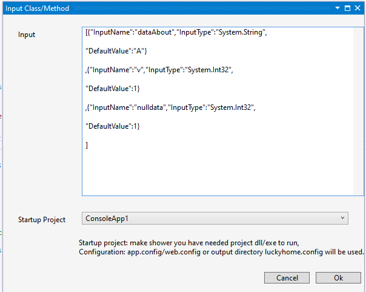
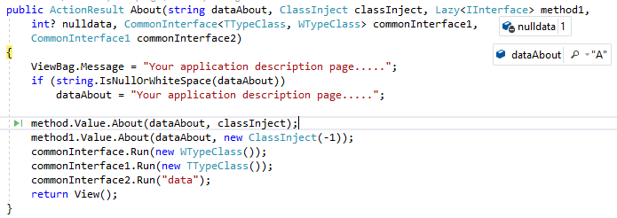

Why should we code to test a method

No need for postman or any testing framework for c# development for testing.

use 
# DMH debug method helper

## Extension for Visual Studio 2015/2017/2019

Steps:
1. Right-click on any method and click "debug method"
2. Resolve dependency using UI Map dependency/skip all dependency/map by code(for autofac etc),
3. Set input parameter values for that method
4. Startup Project config will be used by default if you want you can also use a custom config
For custom config create new file name "luckyhome.config" in startup project output directory and add you configuration
5. Start debugging in few seconds

Not just for web services or web API it supports all frameworks written in c#.


### (note : don't change namespace(LouckHome), class and method name for map by code )

```
//Add this code in your startup project selected in UI
using Autofac;

namespace LuckyHome
{
    public class LuckyHomeInterfaceClassMapper
    {
        private readonly static ILifetimeScope scope;

        static LuckyHomeInterfaceClassMapper()
        {
            HttpConfiguration config = new HttpConfiguration();
            scope = AutofacConfig.Register(config, false).BeginLifetimeScope();
            //not only autofac you can use any resolver
            //If you want you can even do mock for some type
        }
		
        public object Run(Type type)
        {
            var output = scope.Resolve(type);
            //If you want you can even do mock for some type
            if (output == null)
            {
            }
            return output;

        }
    }
}
```






### supported Core version are 2.1 & 3.1

To get Core Dependency supported please use below code.

### (note : don't change namespace(LouckHome), class and method name for map by code )

```
//Add this code in your startup project selected in UI
namespace LuckyHome
{
    public class LuckyHomeInterfaceClassMapper
    {
        // private readonly static ILifetimeScope scope;
        //static IConfiguration configuration;
        private static IServiceProvider serviceProvider;
        
         static LuckyHomeInterfaceClassMapper()
        {
            var services = new ServiceCollection();
            // Simple configuration object injection (no IOptions<T>)
            IConfiguration tempIConfiguration = new ConfigurationBuilder()
              .AddJsonFile("appsettings.json", optional: true, reloadOnChange: false)
              .AddUserSecrets("e3dfcccf-0cb3-423a-b302-e3e92e95c128")
              .AddEnvironmentVariables()
              .Build();
            
            services.AddScoped<IConfiguration>(_ => tempIConfiguration);
            services.AddTransient<IframeInterface, FrameInterface>();
            services.Configure<PositionOptions>(tempIConfiguration.GetSection(
                                                    PositionOptions.Position));
            services.AddLogging(builder => builder.AddConsole());
            
            serviceProvider = services.BuildServiceProvider();
        }

        public object Run(Type type)
        {
            object output = serviceProvider.GetService(type);
            if (output == null)
            {
                output = serviceProvider.GetRequiredService(type);
                if (output == null)
                    throw new NotImplementedException();
            }
            return output;
        }
    }
}
```
appsettings.json change the property to copy to output directory

Finally edit core project csproj file to run in windows 10 by adding this code.
```
 <PropertyGroup Condition="'$(Configuration)|$(Platform)'=='Debug|AnyCPU'">
    <RuntimeIdentifier>win10-x64</RuntimeIdentifier>
  </PropertyGroup>
  ```
